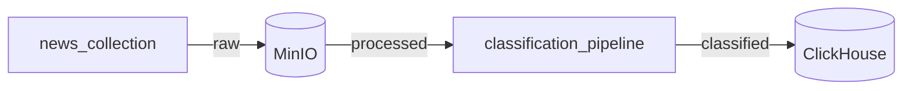

# 📰 NewsMonitor

**Система мониторинга и классификации технических новостей.** Автоматически собирает новости из HackerNews и Dev.to, классифицирует их и визуализирует аналитику в Grafana.

<p align="center">
  
</p>

---

## ✨ Возможности

- **Автоматический сбор** — ежедневный сбор новостей из HackerNews и Dev.to
- **ML-классификация** — через HuggingFace Inference API
- **Real-time аналитика** — дашборды в Grafana с данными из ClickHouse
- **11 категорий** — AI/ML, Backend, Frontend, DevOps, и др. Список расширяем
- **Retry-механизм** — устойчивость к сбоям API с exponential backoff
- **S3-совместимое хранение** — MinIO для сырых и обработанных данных

---

## 🏗️ Архитектура



---

## 🛠️ Tech Stack

| Компонент          | Технология           | Назначение                     |
|--------------------|----------------------|--------------------------------|
| **Оркестрация**    | Apache Airflow       | Сбор и классификация новостей  |
| **ML**             | модель с HuggingFace | Классификация                  |
| **Object Storage** | MinIO                | S3-совместимое хранение данных |
| **Analytics DB**   | ClickHouse           | OLAP, быстрая аналитика        |
| **Visualization**  | Grafana              | Дашборды, метрики              |

---

## 🚀 Quick Start

```bash
# 1. Настроить переменные окружения
cp .env.example .env

# 2. Изменить логины/пароли в .env и в compose.yml, если необходимо

# 3. Развернуть окружение
make up

# 4. Открыть UI
# Airflow:  http://localhost:8080
# Grafana:  http://localhost:3000
# MinIO:    http://localhost:9001
```

---

## 📊 Data Schema

**ClickHouse Tables:**

| Таблица           | Описание                                             |
|-------------------|------------------------------------------------------|
| `news_classified` | Классифицированные новости с категорией и confidence |
| `api_usage`       | Логи вызовов HuggingFace API (tokens, latency)       |
| `processing_log`  | История обработки файлов                             |

**MinIO Buckets:**

| Bucket           | Содержимое                          |
|------------------|-------------------------------------|
| `raw-news`       | Сырые данные из источников (JSON)   |
| `processed-news` | Препроцессированные тексты          |
| `classified-news`| Результаты классификации            |


---

## 📝 Makefile Commands

```bash
make up       # Запуск
make down     # Остановка
make plint    # pretty + lint
```
